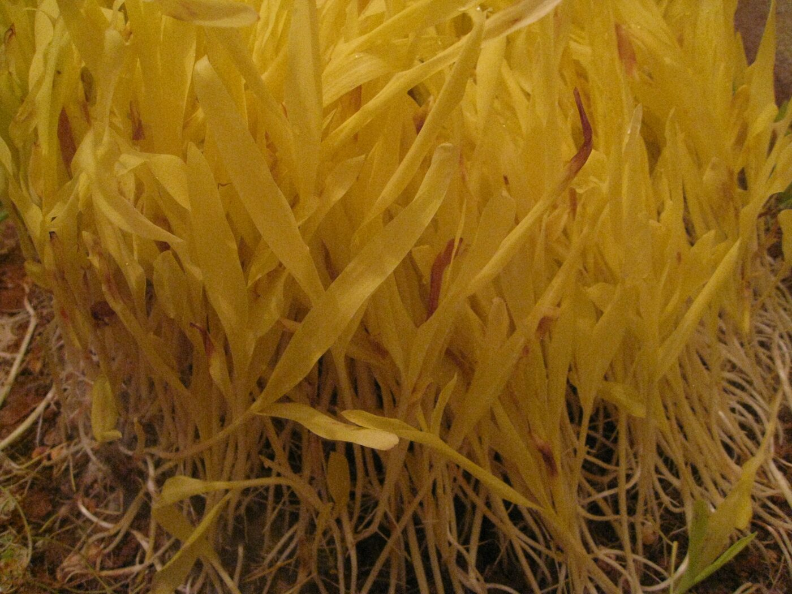

# Adding photos to the Nepal–Oita site

The site is designed to look finished **without any photography**. Every image
slot currently renders generated CSS artwork, so nothing is broken or missing —
you can publish today and add real photos whenever you have them.

Adding real photos needs no HTML editing — just drop files into `images/photos/`
with the right names. This guide lists them.

---

## Theme

**The site is light-only.** There is no dark mode and no theme toggle — the
feature was removed, along with its `localStorage` key, the sun/moon button, the
pre-paint script and every `:root[data-theme="dark"]` block. `assets/theme.css`
declares `color-scheme: light` so form controls and scrollbars follow suit.

If you ever want it back, every colour is already a token: add a
`:root[data-theme="dark"]` block redefining them, plus a toggle that sets that
attribute. Nothing else in the stylesheet hard-codes a colour.

## The images folder

Every watermarked stock file has been deleted. What remains is real,
properly-licensed photography:

| File | Subject | Licence |
| --- | --- | --- |
| `best.png` | Hero, **both pages** — mountains, bay and city in one frame | supplied by you |
| `place-everest.jpg` | Sagarmatha | CC BY 4.0 — V. Argenberg |
| `place-amadablam.jpg` | Ama Dablam | CC BY 4.0 — V. Argenberg |
| `place-boudhanath.jpg` | Boudhanath stupa | CC BY 4.0 — V. Argenberg |
| `place-umijigoku.jpg` | Umi Jigoku, Beppu (also behind "Join us") | CC BY 2.5 — 663highland |
| `place-usajingu.jpg` | Usa Jingu shrine | CC BY 4.0 — Immanuelle |
| `place-sakura.jpg` | Ono River cherry blossom | CC BY-SA 4.0 — Project Kei |

Unused, kept in the folder: `everest.jpg`, `hero-city.jpg`, `hero-everest.jpg`,
`oita_city.webp`, `og-cover.jpg`, `sample.png`.

**The footer still credits Beppu city by そらみみ.** That photograph is no longer
used anywhere on the site, so that one credit line can be deleted.

### ⚠️ `oita_city.webp` is not licensed

It is a Dreamstime **preview** file with "dreamstime.com" tiled across the bay. It
is no longer referenced by either page. Either buy the licence or delete it —
publishing it as-is is a copyright problem, not a cosmetic one.

**The credits in the footer are a licence condition — do not delete them.** If
you swap a photo out, remove its line from the credits too.

### Removed

These were deleted because every one carried a visible stock watermark, or was
left unused. All are recoverable with `git checkout -- images/` if you want them
back:

`oita-city.jpg`, `oita-city-gallery.jpg`, `qr-code.jpg`, `photos/photo1–4.jpg`,
`events/event1–3.jpg`, `nepal-oita-bg.jpg`, `nepal-oita-bg2.jpg`,
`hero-oita.jpg`, `hero-nepal.jpg`, `hero-beppu.jpg`, `hero-oitacity.jpg`.

Also removed: `everest-hd.webp` and `city-hd.webp` — generated files for the old
two-layer hero, made obsolete by `best.png`.

If you buy a licence for any of them, drop the clean file back in at the same
path and it will work — no code changes needed.

### Replacing the hero photograph

**The hero is one image**, `best.png`, used on both the homepage and the gallery
header. There is no layering, no band, no mask and no seam to disguise — the
mountains, the bay and the city are already composed in a single frame.

It is used **exactly as supplied**: full 1536 x 1024, no resizing, no
re-compression, no colour grading. The `saturate`/`contrast` filters that used to
sit on the hero were removed; they existed only to make two separate photographs
agree with each other.

To swap it, overwrite `images/best.png`. Landscape, around 3:2 — that is close to
the hero's own proportion, so almost nothing gets cropped. Keep the interesting
part near the centre: at phone widths the frame is cropped hard left and right.

Two `object-position` values control the framing, in `assets/theme.css`:

```css
.hero__cell img            { object-position: 50% 50%; }  /* homepage */
.page-head--photo .hero__cell img { object-position: 50% 34%; }  /* gallery header */
```

The gallery header is a wide, shallow box, so it crops top and bottom much harder
than the homepage does — hence the upward bias.

If the file is missing, `app.js` removes the ``, the homepage falls back to
its drawn SVG artwork, and both pages sit on a sky-gradient floor painted on
`.hero__art`, so neither header can ever render blank.

#### A note on file size

`best.png` is **2.9 MB**, and it is the first thing every visitor downloads. That
is slow — the previous hero was 348 KB. Two ways to fix it without any argument
about quality:

| Option | Size | Quality |
| --- | --- | --- |
| `best.png` as-is | 2.9 MB | original |
| lossless WebP | 2.1 MB | **pixel-for-pixel identical** (verified: 0 differing pixels) |
| WebP quality 92 | 0.5 MB | visually indistinguishable (RMSE 1.3%) |

The lossless option is not a quality reduction in any sense — it is the same
pixels in a better container. To generate it:

```sh
magick images/best.png -define webp:lossless=true -define webp:method=6 images/best.webp
```

then point both pages at `images/best.webp`.

## The logo and favicons

Source of truth: **`images/logo.png`** (1254 x 1254). Four files are generated
from it:

| File | Size | Used for |
| --- | --- | --- |
| `logo-mark.png` | 256 | the mark in the navbar and footer, on both pages |
| `favicon-32.png` | 32 | browser tab |
| `icon-192.png` | 192 | Android home screen |
| `apple-touch-icon.png` | 180 | iOS home screen (opaque — iOS puts transparency on black) |

**They use the emblem only, not the whole lockup.** `logo.png` has "NEPALI OITA /
COMMUNITY / EST 2019" baked into it, and the navbar mark is 40px — at that size
the wordmark is about five pixels tall, unreadable, and it would repeat the
typeset "Nepal–Oita / Community" sitting right beside it. The emblem is rows
93–881 of the source; the wordmark starts at row 906.

The surrounding white is made transparent by flooding in from the four corners at
**3% fuzz**, not by keying out white globally. That matters: a global key, or a
higher fuzz, leaks through the anti-aliased edges and eats the white field of the
Japanese flag and the snow on the mountains. If you regenerate and the flag looks
hollow, the fuzz is too high.

```sh
cd images
magick logo.png -crop 1254x800+0+93 +repage -alpha set -fuzz 3% \
  -fill none -draw 'alpha 0,0 floodfill'       -fill none -draw 'alpha 1253,0 floodfill' \
  -fill none -draw 'alpha 0,799 floodfill'     -fill none -draw 'alpha 1253,799 floodfill' \
  -trim +repage -background none -gravity center \
  -extent "%[fx:max(w,h)]x%[fx:max(w,h)]" /tmp/mark.png

magick /tmp/mark.png -filter Lanczos -resize 256x256 -unsharp 0x0.5+0.4+0.02 -strip logo-mark.png
magick /tmp/mark.png -filter Lanczos -resize 32x32   -unsharp 0x0.4+0.7+0.01 -strip favicon-32.png
magick /tmp/mark.png -filter Lanczos -resize 192x192 -unsharp 0x0.5+0.4+0.02 -strip icon-192.png
magick /tmp/mark.png -filter Lanczos -resize 168x168 -unsharp 0x0.5+0.4+0.02 \
  -background white -gravity center -extent 180x180 -strip apple-touch-icon.png
```

`logo.png` itself is referenced once, as the `logo` in the homepage's JSON-LD —
that is the copy search engines may show, so the full lockup is right there.

### At 16–32px the emblem is a blob

Two flags, a mountain range, a torii, a pagoda, a skyline and cherry blossom do
not survive a 32-pixel square. The tab icon reads as a blue-and-red shape rather
than anything identifiable. That is not fixable by resampling — it needs a
*simplified* mark drawn for small sizes (typically just the peak and the two flag
shapes). Worth doing if the tab icon matters to you.

---

### Replacing the "Two homes" photographs

Swap any `place-*.jpg`. They display about 900px wide; keep them under ~150 KB.

---

## Project structure

```text
nepal-oita-community/
├── static-site/        ← THIS SITE. Hand-written HTML, no build step.
│   ├── index.html
│   ├── gallery.html
│   ├── programmes.html
│   ├── stories.html
│   ├── members.html
│   ├── event-*.html    ← one page per event (10)
│   ├── assets/
│   │   ├── theme.css   ← all styling (design tokens at the top)
│   │   └── app.js      ← all behaviour
│   ├── data/
│   │   └── members.json  ← hashed numbers for the members gate
│   ├── tools/
│   │   └── member-hash.html
│   ├── robots.txt
│   ├── sitemap.xml
│   └── images/
│       ├── photos/
│       ├── people/     ← member portraits
│       └── events/
└── web-app/            ← the Next.js + Supabase rebuild (see its own README)
```

**Deploy `static-site/` as the site root**, not the repository root — the paths
inside are relative to it, and `robots.txt` and `sitemap.xml` have to sit at the
top level of whatever is served.

The homepage shows the **first row** of the long sections and links to the full
page. Both copies are the same markup, so when you add a member you add them in
two places: `index.html` (the preview) and `members.html` (the full list). Same
for a programme or a story. See "Show all" below.

---

## The member register — how the gate works

The gate asks for a mobile number and checks it in the visitor's own browser
against `data/members.json`. Nothing is sent anywhere.

### The file holds no readable numbers

Each member's number is stored **only as a PBKDF2-SHA256 hash**, 600,000
iterations, shared salt. A hash cannot be read back into a number. Signing in
hashes what the visitor typed and looks for a match.

**Read this before deciding it is enough.** The file is public, like every other
file on the site, so be exact about what the hashing buys:

| | |
| --- | --- |
| Stops the numbers being **harvested** | Yes. There is nothing in the file a scraper can lift, and nothing a curious visitor can read. |
| Makes the numbers **secret** | No. A Japanese mobile number is about 27 bits. Somebody determined, with a GPU and a few hours, can work back from these hashes. |
| Makes the **lists** private | No. The names are in `members.html`'s HTML either way. |

The 600,000 iterations are what turn that "few hours" from "a few seconds". If
either of the two No's matters to the committee, the check has to move to a
server, and the lists have to be fetched from it rather than sitting in the page.

### Adding a member's number

Open **`tools/member-hash.html`** — from the site folder, over
`python3 -m http.server` rather than by double-clicking, so it can read
`members.json`. Pick the member, type their number, and it prints a `"hash"`
line. Paste that into the member's entry.

**Never type a phone number into `members.json` itself.** Keep the numbers
wherever the committee already keeps them — the paper forms, a spreadsheet on
somebody's own machine.

Format does not matter. `080-4316-4111`, `+81 80 4316 4111` and `8043164111` all
reduce to the same string before hashing, so a member can type it however they
remember it.

### The one number that works today

The file ships with a single working entry so the gate can be tested:
**080 4316 4111** — the community's own already-published number — wired to
`suresh-surkheti`. **Replace it.** Everything else has `"hash": null`, which
never matches anything.

### What is NOT in the file, and must not be

Phone numbers, Facebook links, addresses. The whole point of the gate is to keep
those off the public site, and this file *is* the public site. If a `phone` or
`facebook` field is present on a member the directory will render it — that
support exists so a committee running a real server can reuse the same rendering
code, not as an invitation.

---

## Members editing their own card

The **My profile** sheet asks for the number, then opens the card belonging to
*that* member — the id comes from the register entry that matched, so there is no
way to point it at somebody else's card.

### Saving, and what "saved" honestly means

There is no server, so nothing can be published from the browser. Save does two
things, and the wording in the sheet says both:

1. **Stores the card on that member's own device** (`localStorage`). Their card
   shows the new photo and profession — for them, on that device, labelled
   *"Draft — only on this device"* so nobody mistakes it for being live.
2. **Hands back the photo, resized and correctly named.** A download link appears
   carrying a 512×512 centre-cropped JPEG called `<member-id>.jpg` — exactly the
   filename the card already points at. The member sends that to the committee,
   who drop it into `images/people/` and republish.

The resize is not cosmetic. A phone photo is 5–12 MB, which will not fit in
`localStorage` at all, and the committee needs a web-sized file anyway. Measured:
a 10.4 MB, 1600×2400 source came out at 63 KB.

### To make it save for everybody

That needs a server: an endpoint that takes the photo, works out who is asking
from something better than a phone number, and writes the file. The rule to keep
is that the **request must not name the member** — if the browser sends
`member_id=7`, anyone can change that in the developer tools and overwrite
somebody else's card.

---

## members.html is not indexed, on purpose

`members.html` carries `<meta name="robots" content="noindex, follow">` and is
left out of `sitemap.xml`.

Everyone on it is a named private individual, and a page that is nothing but a
list of them is exactly what you do not want becoming the top Google result for
somebody's name. The page is public — linked from the homepage, reachable by
anyone — it just is not filed under the members' names. Change it to
`index, follow` and add the URL to `sitemap.xml` if the committee decides
otherwise.

---

## `hidden` needs one CSS rule to work at all

Near the top of `theme.css`:

```css
[hidden] { display: none !important; }
```

**Do not remove it.** The UA stylesheet's `[hidden] { display: none }` is the
weakest rule in the cascade, so *any* author `display` on an element beats it.
Three separate features here set `el.hidden` and were silently ignored:

| rule | what it broke |
| --- | --- |
| `.quote { display: flex }` | all six community stories stayed on screen behind a "Show all 6" button |
| `.tile { display: block }` | the gallery category filter hid nothing — every photo stayed visible |
| `.roster li { display: flex }` | the member directory search hid nothing |

Every test passed the whole time, because they asked the DOM
`element.hidden` — which was perfectly `true`. **Assert on what is painted, not
on the property**: `getClientRects().length > 0`, or `getComputedStyle().display`.
The same trap caught `.more-row` earlier, rendering as an empty chevron pill.

## `var` in one big IIFE — the collision that broke the header

`assets/app.js` is a single `(function () { … })()`, and **`var` is scoped to the
function, not the block**. A `var nav` inside an `if` is the same variable as the
`var nav` at the top of the file.

That happened. The events rail's arrow container was `var nav`, which overwrote
the header reference from line 15 — so `onScroll` spent the rest of the session
putting `is-stuck` and `--scroll-progress` on a 40px div. The sticky header and
the progress thread were both dead, and nothing threw. `var prevBtn` / `var
nextBtn` collided with the lightbox's buttons the same way, which left the rail's
back arrow permanently disabled.

They are now `railNav`, `railPrev`, `railNext`, `emptyNote`. Before adding a
top-level `var` to this file, grep for the name.

Two warnings from fixing it:

- A blanket `\bnav\b` rename also rewrote the *string* `'rail-nav'` into
  `'rail-railNav'`, because a hyphen is a word boundary. The class stopped
  matching any CSS. Check strings after a regex rename.
- Duplicated names that live inside separate `function` bodies (`btn`, `show`,
  `step`, `target`, `first`, `n`, `y`, `id`, `started`) are genuinely scoped and
  fine. Only the block-scoped-looking ones are the trap.

## Events run themselves off the date

Every event card carries `data-event-date="YYYY-MM-DD"`. On load, `app.js` sorts
them against today and lays them out as **one horizontal rail, read as a
timeline**: oldest on the left, newest on the right, with no break in the middle.

The rail is then **parked on the first event still to come**, so the three cards
you see without touching anything are the next three, and the history is behind
you — to the left, where a reader already expects the past to be. Past cards get
`.event--past`, which mutes the date chip.

**Nothing needs editing as dates pass.** The morning after an event it moves to
the left of the anchor on its own. To add one, copy a card and set its date — the
order in the markup is irrelevant, since it is sorted at runtime.

The rail also has a **hint line and a pair of arrow buttons** above it. Dragging
a rail is not obvious, and on a desktop without a touchpad there is nothing to
drag with; the arrows scroll by exactly one card plus its gap, and each disables
itself at its end of the rail rather than disappearing (a vanishing arrow makes
the other one jump sideways). At load **both** arrows are live, because there is
history to the left and more dates to the right.

### Event detail pages

Each event has its own page, `event-<slug>.html`, and the card's **Details**
control is a plain link to it — no dialog. The ten pages were generated from the
`data-event-source` JSON on the cards, so they cannot drift from what links to
them. Each carries its own `<title>`, description, canonical URL, Event
structured data, and previous/next links.

**If you add an event, generate its page too**, or the Details link will 404. The
pages are plain HTML: copy the nearest one and edit it.

The date chip is now a solid block of the event's accent colour with **white**
month and day; a past event keeps white text on a muted grey ground, so it reads
as the same component without competing with dates you can still attend.

The markup ships as an ordinary `.grid.grid--3`, and the rail is switched on in
JS by swapping the classes. With scripting off the section renders as a plain
grid of every event, which is the right fallback.

### Two things that are easy to get wrong here

**Do not parse the date with `new Date("2026-09-13")`.** A bare date string is
parsed as UTC midnight, which is **the previous day in Japan** — every event
would flip to "past" nine hours early. The date is built from its parts instead,
which gives local midnight.

**The rail needs `tabindex="0"`.** A scrollable `div` is not focusable, so
without it a keyboard user cannot scroll the history at all. It is set in JS
along with a `role="group"` and a label.

**The rail needs `scroll-padding-inline: 4px`** to match its 4px side padding.
That padding is there to stop the cards' shadows being clipped; without the
matching scroll padding, snapping aligns cards to the scrollport edge instead and
shaves those 4px straight back off whichever card it lands on. Measured: the
anchor landed at 2068 instead of 2064.

The rail's fading right edge is a `mask-image` toggled by class, so it only
appears while there is actually more to scroll to, and clears at the end.

**Setting `scrollLeft` directly, not `scrollIntoView`.** `scrollIntoView` on a
card would scroll the *page* down to the events section on load as well. The
anchor offset is the difference between two `offsetLeft` values, which cancels out
whatever the shared `offsetParent` happens to be, so it needs no assumption about
positioning. It is applied once more on the next frame, because the web fonts and
the lazy portraits both land afterwards and either can change a card's width —
and only once, because after that the scroll position belongs to the reader.

### Rail layout gotcha

`grid-auto-columns: minmax(280px, 1fr)` looks right and is wrong: inside a
scroller `1fr` resolves against the *visible* width, so every card becomes one
viewport wide. It needs a fixed track — `min(84vw, 320px)`.

## "Show all" — one row, then its own page

Any grid carrying `data-more` shows a preview and hides the rest behind a centred
ghost control. There are two kinds of control, and the markup picks:

| attribute | control | what happens |
| --- | --- | --- |
| `data-more` | a **button** | expands the grid in place |
| `data-more-href="page.html"` | a **link** | goes to a page holding the full set |

Four sections use the link, because that is the better answer once a section is
long: a grid that expands to fifteen cards pushes everything below it off the
screen and gives the reader no address to return to or send to anyone, while a
page has a title, a URL and a back button.

| section | full page | members only? |
| --- | --- | --- |
| What we do (6) | `programmes.html` | open |
| Community stories (6) | `stories.html` | open |
| Leadership team (13) | `members.html` | **asks for a number** |
| General members (15) | `members.html` | **asks for a number** |

A section marked `data-more-gate` gets a **button**, not a link — it has to stop
and ask before it goes anywhere, and a link that does not navigate lies to anyone
who reads the status bar or opens it in a new tab. It carries a shield rather than
an arrow, and a line underneath saying it will ask.

Neither link carries a `#fragment` any more: they land on `members.html` at its
**header**, and the page offers jump links to the two lists once it opens.
Arriving halfway down a page you have not seen is disorienting.

The link version never toggles, so the homepage preview stays a preview. It shows
an **arrow** rather than a chevron — a chevron promises the page will unfold, an
arrow promises it will move — and carries no `aria-expanded`, because a link does
not expand anything.

**The full pages hold the same markup as the previews.** Adding a member means
editing two files: `index.html` for the preview and `members.html` for the full
list. Same for a programme (`programmes.html`) or a story (`stories.html`).

The whole control is built by **`app.js`**, not written in the markup. Two
reasons: with scripting off the full grid renders and there is no dead button to
explain, and the control can decide for itself whether it is needed at all.

### How much it shows

**Rows are measured, never counted.** These grids change column count between
phone and desktop, so "show the first three" would leave a ragged half-row on one
of them. `previewCount()` groups the cards by their `offsetTop` — each distinct
top is one row — then adds whole rows until at least **three** cards are visible.

That minimum matters on phones. A single-column grid's first row is *one* card,
and one story above a "Show all 6" button reads as a bug rather than a preview.
Measured previews:

Measured, at three widths:

| grid | 390px | 768px | 1440px |
| --- | --- | --- | --- |
| Who we support (4) | 4, no control | 4, no control | 4, no control |
| What we do (6) | 3 | 4 | 3 |
| Community stories (6) | 3 | 4 | 3 |
| Leadership team (13) | 4 | 3 | 5 |
| General members (15) | 3 | 5 | 5 |

### When the button hides itself

If the preview already covers the grid, **or leaves only one card behind**, the
control is hidden — a control that reveals a single extra card costs the reader
more than just showing it. That is why "Who we support" has no control at any
width: its first row is four cards at desktop, and on a phone the three-card
minimum plus the one-card rule swallows the fourth.

### Two traps this hit

**`hidden` on a flex container does nothing.** `wrap.hidden = true` sets the
attribute, but `.more-row { display: flex }` is an author rule and beats the
UA's `[hidden] { display: none }`. The hidden button kept its flex box and
rendered as an **empty chevron pill** under the row. Fixed with a global
`[hidden] { display: none !important; }` — and note a test that reads the
`.hidden` *property* will pass right through this, because the property is
perfectly true. Check `getComputedStyle().display`.

**Hide with `hidden`, not with a class.** The attribute takes the extra cards out
of the tab order and the accessibility tree as well as out of the layout. With a
class they stay invisible but focusable, and a keyboard user tabs into a stack of
cards they cannot see. Verified: zero reachable links inside collapsed cards.

Cards revealed by the button carry `.reveal`, so they are marked `is-in` on the
next frame rather than waiting for a scroll that may never come.

## People photos — the drop-in slots

Every person on the page takes a portrait the same way the gallery tiles take a
photograph: **put a file in the folder and it appears.** No code change, no
build step. If the file is not there, `app.js` removes the `` and the
coloured initials stay, so a person without a photo still reads as a person.

| where | file to add |
| --- | --- |
| Leadership team (13) | `images/people/prakash-rasaili.jpg` — first-last, lower case, hyphenated |
| Advisers (7, same grid) | same pattern, e.g. `images/people/ashok-lama.jpg` |
| General members (15) | `images/people/member-01.jpg` … `member-15.jpg` |

General-member cards show **the first letter of the name** as the fallback, the
same as the leadership cards, and the photo replaces it once the file is there.
The placeholder names run *Member A* to *Member O* so those letters are visibly
per-person; rename them and the letter follows.
| Community stories (6) | `images/people/story-01.jpg` … `story-06.jpg` |

Square images work best — they are cropped to a circle with `object-fit: cover`.
400x400 is plenty.

### Facebook and phone links

Each office-holder and committee card has two link slots. Both need filling in
by hand, because I had no per-person data:

```html
<!-- Replace # with this person's Facebook profile URL -->
<a href="#" aria-label="Prakash Rasaili on Facebook">
<!-- Replace with this person's own number when you have it -->
<a href="tel:+818043164111" aria-label="Call Prakash Rasaili">
```

Every phone link currently points at the **community** number,
`080 4316 4111`. That is deliberate — it is a real number that reaches someone —
but it means all thirteen cards dial the same place until you paste individual
numbers in.

### Why the leadership team uses flex, not grid

All thirteen sit under the one **Leadership team** heading — the six office
holders followed by the seven advisers, each showing its own role. There is no
separate advisers grid or label.

Thirteen divides into no column count cleanly, and that is the whole reason
`.people-flow` is `display: flex; flex-wrap: wrap` rather than a grid. **A
wrapped flex line can be centred; an incomplete grid row cannot.** At five per
row that gives 5 + 5 + 3, with the last three sitting under the middle of the
row above — measured centred to within 1px. In a grid the remainder would hang
off the left edge and read as a card left stranded.

The basis is `calc((100% - 4 * gap) / 5)` with `flex-grow: 0`. The zero grow
matters: let them grow and the final row of three stretches to full width.

Columns step down 5 → 4 → 3 → 2 as the screen narrows; two on a phone, because
names like "Yangi Sherpa Gole" wrap to three lines at a third of a 390px screen.

The **general members** stay on a fixed 5-column grid — fifteen makes three full
rows, so there is no remainder to centre.

## The gallery photographs — what is in there and why

Seven of the twelve gallery tiles carry real photographs sourced from **Wikimedia
Commons**. Five deliberately do not. The credits are in the footer of *both*
`index.html` and `gallery.html`, because CC BY-SA requires attribution wherever
the work appears.

| tile | photograph | licence | photographer |
| --- | --- | --- | --- |
| Dashain | Dasain Jamara | CC BY-SA 3.0 | 南アジア |
| Tihar | Diyo | CC BY-SA 4.0 | Gaurav Dhwaj Khadka |
| Holi | Holi at Basantapur | CC BY-SA 4.0 | Bijay Chaurasia |
| Masked dance | Devi Nach (Di Pyakhan) | CC BY-SA 4.0 | SuyogyaRT |
| Dal bhat | Dal Bhat Tarkari, Nagarkot | CC BY-SA 4.0 | 松岡明芳 |
| Nepali New Year | Chariot of Barahi | CC BY-SA 4.0 | Nyeta |
| Devanagari | Bhanubhakta Ramayana manuscript | Public domain | — |

### Three rules these were picked under

**Never Google Images.** Almost everything it returns is all-rights-reserved.
Commons, Openverse, Unsplash and Pexels are the places to look. This repo has
already been caught once: `oita_city.webp` is a watermarked Dreamstime preview
and is still sitting in `images/` unlicensed — see the warning further up.

**No identifiable faces.** A CC licence covers the *photographer's* copyright,
not the *subject's* likeness. Several strong candidates were dropped for this —
a close-up of one young man covered in Holi colour, and two people serving dal
bhat. What is left is the symbols and the food: jamara, a diyo, a chariot, a
manuscript, and crowds wide enough that nobody in them is the subject. The
masked-dance tile works precisely because Lakhe and Devi dancers are masked.

**A caption must describe the photograph, not claim an event.** The tiles used
to read "Dashain gathering · Tika and blessings · Oita City, October". With a
stock photograph under it that sentence asserts this is the community's own
October event, which it is not. Every tile that received a photograph was
reworded to say what the picture actually shows.

Note there are **two** captions per tile and they are separate markup:

- `data-slide-title` / `data-slide-text` on the `<button>` — feeds the lightbox
- `.tile__caption-title` / `.tile__caption-text` inside it — the visible caption

Rewriting only the first leaves the false claim on screen. Both must change.

### The five tiles left on generated artwork

Monthly meetup, Student orientation, Volunteer clean-up, Football tournament and
Volleyball afternoon. The first three are inherently *these members doing this
thing*, and no stock photograph can stand in for that. The last two had nothing
usable — every Nepal football candidate was a close shot of identifiable players,
and the only faceless one was a stadium in Bhutan.

**Their captions were deliberately left alone.** Artwork makes no visual claim,
so "Monthly meetup · every second Sunday" over a drawn panel is simply the
community's own true statement about itself and needs no hedging.

Each still keeps its ``, so dropping a real
`images/photos/monthly-meetup.jpg` in makes it appear with no code change.

### Encoding

1400x1050 (the tile's 4:3, and large enough for the lightbox), `-quality 82`,
`-sampling-factor 4:2:0`, stripped, progressive. The chroma subsampling took 23%
off the heaviest file (Holi, a busy crowd) at RMSE 0.02 — far below anything
visible. All seven come to 2.0MB and every one is `loading="lazy"`.

The manuscript needed a **pre-crop** before the aspect fill: the archival scan
has an upside-down colour calibration target below the page, and because the
source is *wider* than 4:3 the fill trims the sides and leaves the target in
frame. `-crop 1867x1400+631+70` first, which also makes the tile a detail of the
script rather than a whole page seen too small.

### Photographs change what the scrim has to do

`.tile__scrim` only ever had to carry white text over flat, dark generated
artwork. Real photographs put sunlit crowds and white rice directly behind the
caption: measured **2.64** on the chariot and **2.82** on the masked dance,
against a 4.5 floor. The gradient is now deeper and steeper at the bottom, and
all fourteen caption strings measure **5.28 or better**.

Two hover rules were also removed. They read `opacity: 0.92` on `.tile__scrim`
and `0.88` on `.place__scrim`, written as "the scrim deepens on hover" — but a
scrim already at opacity 1 can only go *lighter*, so they cut caption contrast at
the exact moment someone was looking at the tile.

The caption title is `1.02rem` at weight 600 — that is **not** WCAG large text
(which needs 18.66px bold or 24px), so it takes the full 4.5 threshold, not 3.0.

## Adding a photo: just drop the file in

**You do not need to edit any HTML.** Every tile already points at a filename in
`images/photos/`. If the file exists it is shown; if it does not, the tile falls
back to its generated artwork automatically.

So to add a photo, save it into `images/photos/` with the matching name below:

| Save the file as | It appears as |
| --- | --- |
| `dashain-gathering.jpg` | Dashain gathering *(homepage + gallery)* |
| `monthly-meetup.jpg` | Monthly meetup *(homepage + gallery)* |
| `traditional-dance.jpg` | Traditional dance *(homepage + gallery)* |
| `tihar.jpg` | Tihar *(homepage + gallery)* |
| `holi-in-the-park.jpg` | Holi in the park |
| `student-orientation.jpg` | Student orientation |
| `food-festival.jpg` | Food festival |
| `annual-football-tournament.jpg` | Football tournament |
| `nepali-language-class.jpg` | Nepali language class |
| `volunteer-clean-up.jpg` | Volunteer clean-up |
| `nepali-new-year.jpg` | Nepali New Year |
| `volleyball-afternoon.jpg` | Volleyball afternoon |

Add one, add all twelve, or add none — the gallery looks complete either way, and
you can mix real photos and artwork side by side without it looking unfinished.

The Facebook QR code works the same way: save it as `images/qr-code.png` and it
replaces the dashed placeholder.

### Improving the alt text

The fallback `alt` is just the tile title. Once you add a real photo, it is worth
opening the file and describing what is actually in the picture, for people using
a screen reader:

```html

```

Keep the `class`, `loading` and `decoding` attributes. The show-or-fall-back
logic lives in `assets/app.js`, not in the markup, so there is nothing else to
wire up.

---

## Photo specifications

| Where | Ideal size | Aspect | Notes |
| --- | --- | --- | --- |
| Gallery tiles | 1200 × 900 px | 4:3 | Cropped to fill, so keep faces away from the edges |
| Lightbox | 1600 × 1200 px | 4:3 | Same file is used for both — 1600px is a good compromise |
| QR code | 600 × 600 px | 1:1 | PNG, not JPG — JPG artefacts can stop it scanning |

Keep each file **under about 300 KB**. Export as JPG at quality 75–80, or WebP
if you are comfortable with it. Large photos are the single easiest way to make
a fast site slow.

---

## The Facebook QR code

Save it as `images/qr-code.png` — that is all. Generate the code from your actual
Facebook page URL, and **test that it scans from a phone before publishing**; a
QR code nobody can scan is worse than no QR code. Use PNG, not JPG: JPG
compression artefacts can stop a code scanning.

---

## Adding a brand new gallery tile

Copy any existing tile in `gallery.html` and change five things:

1. `data-category` — one of `festivals`, `community`, `cultural`, `sports`
   (this is what the filter buttons use)
2. `data-slide-title` and `data-slide-text` — the lightbox caption
3. The `src` on the ``, and its `alt`
4. The `<h3>` and `<p>` inside `tile__caption`
5. The wash and motif classes, so it does not look like its neighbour

The photo count in the filter rail updates itself, so you can leave it.

### Choosing the fallback artwork

- **Washes:** `tile--crimson`, `tile--indigo`, `tile--moss`, `tile--gold`
- **Motifs:** `art-wave` (seigaiha), `art-lattice` (asanoha), `art-rays`
  (mandala), `art-dots` (sakura scatter), `art-ridge`, `art-bunting`

```html
<div class="tile__art art-wave"></div>
```

Mix them so no two neighbouring tiles look the same.

---

## Changing the colours

All colour lives in CSS custom properties at the top of `assets/theme.css`.
Change these and everything follows:

```css
--crimson: #A62432;   /* Nepal red, deepened so it reads as ink */
--indigo:  #1E3A6E;   /* Nepal blue — also the secondary button */
--gold:    #A97A2E;
--moss:    #3D6650;
```

There is one set of values — the site is light-only, so nothing needs a second
definition.

### The footer holds one line, so credits moved

The footer is now only:

> © 2026 Nepal–Oita Community. All rights reserved.

CC BY and CC BY-SA still **require** the photo credits to be given, so they did
not disappear — they moved to a `<details class="credits-note">` in a thin strip
directly above the footer, folded shut, on both pages. Do not delete it; the
photographs are licensed on condition that it is there.

(They were previously wrapped in an HTML comment, which meant the site was
using seven CC-licensed photographs with no attribution shown at all.)

### Vertical rhythm — one token sets all of it

`--section-y` is the padding at the top and bottom of every `.section`, so the
band of quiet **between** two sections is twice it:

| | `--section-y` | gap between sections |
| --- | --- | --- |
| 1440px+ | 72–80px | ~152px |
| tablet | 52–72px | ~112–152px |
| phone | 44px | ~96px |

It was `clamp(4.5rem, 9vw, 8rem)` — 128px, so **264px of dead page** between
every pair of sections at 1440px. That does not read as breathing room, it reads
as the content having run out. At ~150px you can see the next heading coming
while you finish the last line of the one before it.

Two things follow this token and should stay proportional to it:

- `.section-head`'s `margin-bottom` is roughly a **third** of the gap between
  sections, so a heading reads as belonging to the content under it rather than
  floating between two blocks.
- `scroll-margin-top` on section anchors is
  `calc(var(--nav-h) - var(--section-y) + 2rem)`. That formula is
  self-correcting: whatever `--section-y` becomes, a clicked anchor still lands
  its first content exactly `--nav-h + 2rem` (108px) from the top, clear of the
  fixed bar. Verified at 108px for all six nav anchors. Do not replace it with a
  fixed value.

### Section grounds — read this before adding a section

The page is white-dominant. Most sections share one near-white ground; the
structure comes from **two dark anchors** plus **two soft grey-cream bands**:

| Token | Value | Sections |
| --- | --- | --- |
| `--paper` | `#FBFAF7` | About, What we do, Upcoming, Community stories, Contact |
| `--paper-2` | `#EBE8E0` | Gallery, Our people |
| `--panel-ink` | `#1B1714` | **Two homes**, **Join us** |

Cards are pure `--surface` (`#FFFFFF`) and carry a resting `--shadow-sm`. On a
near-white ground the shadow is what gives them an edge — the 10%-opacity border
alone is invisible there, so do not remove it.

**Adjacent sections may share `--paper`.** That is deliberate: a continuous
near-white run reads as one calm ground, and the headings supply the structure.
An earlier version alternated two beige tones on every section and it read as one
long unbroken beige scroll — more tint did not help, less did.

`--ink-3`, the muted text token, measures **4.79** on `--paper-2` and **5.62** on
`--paper`. Both pass, but `--paper-2` has little headroom: darken it and you must
darken `--ink-3` too.

Moving a section onto `--panel-ink` means re-asserting its dark tokens or they
vanish into the panel. For "Two homes" that was the `.places__label` text, the
rule beneath it and the photo hairlines — see `.section--ink .places__label`.

### The hero copy is a centred column

`.hero__content` is capped at `calc(48rem + var(--gutter) * 2)`, so `.container`'s
own `margin-inline: auto` centres it. Two things about that cap are deliberate:

- **The gutter is added on top.** `.container` applies `padding-inline: var(--gutter)`,
  so a bare `44rem` cap left only ~608px of actual text and the headline broke to
  three lines. The cap has to be *text column plus both gutters*.
- **The hero headline has its own size.** `.hero .display-1` is capped at `4.1rem`
  rather than the shared `display-1` scale's `5.25rem`. At 5.25rem
  "Bridging Nepali Hearts" cannot fit one line inside this column, whatever the
  viewport. Measured two lines from 480px to 2000px; three at 390px, which is
  expected on a narrow phone.

**Centring the block is not the same as centring the copy.** `.hero__content`
also needs `text-align: center`, `.hero__lede` needs `margin-inline: auto` (it has
its own 34rem cap), `.hero__actions` needs `justify-content: center`, and the
eyebrow uses the `eyebrow--center` variant so its rule appears on both sides.
Without those the block sits centred but the text hugs its left edge with all the
slack on the right, and reads as off-centre — which is exactly how it looked
before. Verified by measuring each rendered line box: all at 0px from the viewport
centre.

**The veil must match wherever the copy sits.** `--hero-scrim`'s halo is at
`48% 39%` to sit under the centred column. It was briefly moved to `33%` while the
copy was flush-left; if you move the copy again, move the halo with it, or the
text lands in the weakest part of the veil and stops being readable.

### Phones

Two width-keyed blocks at the end of `assets/theme.css` do this work. Both exist
for measured reasons:

- **`.grid--people` goes 2-up (committee 3-up).** The people grids ask for 230px
  and 180px columns; a 390px phone offers about 350px inside the container, so
  every card went full width and "Our people" alone ran to **4,076px**. The class
  exists so only the people grids are affected — the feature-card grids carry a
  paragraph each and turn into eight-line slivers if squeezed.
- **`.places__grid` and `.tiles` go 2-up.** They were one-up, which made "Two
  homes" the second-longest section.
- **`--section-y` drops to `clamp(2.75rem, 8vw, 3.5rem)`** — 44px, giving 96px
  between sections. A narrow screen is already filled vertically by one section,
  so it needs far less margin to read as its own thing.
- **The two hero buttons stack, each full width**, so both edges line up with the
  copy above them. One grid track rather than flex-wrap, so they stay exactly
  equal whatever the labels say. Verified stacked, full-width, equal and unclipped
  from 320px to 600px.
- **The stat strip is pinned to 2x2.** Its `minmax(140px, 1fr)` tracks need 281px
  including the gap; a 320px phone offers 280px, so `auto-fit` silently dropped to
  a single column — four rows, 312px instead of 165px, which pushed the hero 162px
  past the fold. It stays 4-across above 620px.
- **`@media (max-height: 620px)`** trims the space under the navbar. With the
  buttons stacked, 320x568 needed another ~16px to keep the stat strip above the
  fold; the padding gives it up rather than any content.
- **Touch targets reach 44px** — footer links were 17px tall, social buttons 36px,
  the burger 40px, "Details" 24px. They gain height as padding, so nothing looks
  bigger. The photo-credit links are **deliberately left alone**: they sit inline
  inside a sentence, which WCAG's target-size rule exempts, and padding them
  would break the prose.

Those queries are keyed to `max-width`, not `pointer: coarse`, so the result can
actually be tested in a headless browser.

Page height on a 390px phone: **17,689px → 14,649px.**

### The fallback gallery panels

Tiles with no photograph yet fall back to drawn artwork. Those panels use their
own deep tokens, **not** the pale `*-wash` chip colours:

```css
--tile-crimson: #8E3038;   --tile-indigo: #2C4470;
--tile-moss:    #3C6350;   --tile-gold:   #8E6428;
```

The pale washes are right for small inline chips but at tile size they looked like
blank boxes — four gaps in the middle of the page. The motif lines are also
flipped to `rgba(255,255,255,0.17)` inside `.tile__art`, since the default dark
ink vanishes on these deeper fields. White captions measure 9.7–15.6 against them.

## Motion

All of it lives in **section 22 of `assets/theme.css`**, with the JavaScript half
in the `ambient motion` block of `assets/app.js`. Two rules run through it:

**Only compositor properties animate** — `opacity`, `translate`, `scale`,
`rotate`, `transform`, `filter`. Nothing animates width, height, top or margin,
so no frame of any of it costs a layout pass.

**`translate`/`scale` belong to the animation; `transform` belongs to the
interaction.** They are separate longhands that compose, so an entrance holding
`translate: 0 0` cannot cancel a hover asking for `transform: translateY(-4px)`.

### Do not put a reveal's rest state on `transform`

This is the trap, and the site fell into it. The reveal used to read:

```css
.js .reveal { transform: translateY(18px); }
.js .reveal.is-in { transform: none; }     /* three classes */
```

`.js .reveal.is-in` is three classes; `.card:hover` is one class and one
pseudo-class. The rest state therefore **outranked every hover rule on the
page**, and the lift on cards, tiles, people and quotes silently did nothing —
measured as `transform: none` under a forced `:hover`. Moving the offset to
`translate` gives the two effects a property each and both work.

### What runs where

| Where | What |
|---|---|
| Hero, on load | Eyebrow → headline → sentence → buttons → stat strip, each a beat behind the last. Whole sequence done inside 1.4s. |
| Hero headline | Resolves out of focus as well as up (`title-in`) |
| Hero photograph | 36s `ken-burns` drift, paused whenever the hero is off screen |
| Nav, on load | Brand, then the links dealing out, then the CTA |
| Nav, on scroll | 3px crimson→gold→indigo progress thread, appears once the bar sticks |
| Sections, on scroll | `.reveal` + `IntersectionObserver`, staggered 80ms per sibling, capped at 6 |
| Cards, on hover | Lift, accent hairline thickening, icon plate springing, and a wash of the card's own accent colour following the cursor |
| Tiles / places, on hover | Photo zoom, caption lift, scrim deepening |
| Buttons, on hover | A light sweeping across the face; press gives and snaps back |
| Drawer, on open | Links dealing out behind the panel |
| Gallery filter | Surviving photos re-deal, 45ms apart; the clicked chip pops |

### Adding motion to something new

Reveal on scroll — add the class, nothing else:

```html
<article class="card reveal">…</article>
```

Directions are available where they mean something: `reveal--left`,
`reveal--right`, `reveal--zoom`. The stagger is automatic from sibling position.

### Turning it off

Everything is decorative and everything respects
`prefers-reduced-motion: reduce`. The blanket rule near the top of `theme.css`
collapses **durations and delays both** — the delays matter as much: a staged
entrance is `animation-delay` plus `animation-fill-mode: both`, so zeroing only
the duration would leave every element holding its *hidden* first keyframe for
the length of its delay. That is a second of blank hero, then everything
snapping in at once. Section 22.6 then handles the cases the blanket rule cannot
reach — an infinite animation would still land on its final frame, and a sheen
or a cursor wash would still appear, just instantly.

### Three things that will bite

**Do not animate a wrapper and its child with the same keyframe.** The offsets
compound. `.hero__stats` and the `.statbar` inside it both had `rise-in` for a
moment, and the strip travelled 48px instead of the 24px asked for.

**A cursor wash needs to go *behind* the copy.** An `::after` with no `z-index`
paints over the text, and a 10% wash laid over body copy takes measurable
contrast off it for nothing. `z-index: -1` plus `isolation: isolate` on the card
puts it over the white fill and under the words — measured 8.6 either way, but
free is better than nearly free.

**Do not key a one-shot animation off an attribute that is already set.** The
chip pop used `[aria-pressed="true"]`, which is present on the default chip at
first paint — so one chip popped out of a row that was still fading up, and the
animation could never replay on a repeat click. `app.js` sets an `is-picked`
class on the click instead, with a forced layout read between removing and
re-adding it, or the browser coalesces the two into no change at all.

### Contrast under a moving background

The `ken-burns` drift changes what sits behind the hero text over its 36s cycle,
so hero contrast has to hold at **both** ends of the zoom, not just at rest.
Measured at `scale: 1.006` and `scale: 1.075`:

| | drift start | drift end |
|---|---|---|
| eyebrow | 11.6 | 8.5 |
| headline | 10.1 | 10.0 |
| accent (*Oita*) | 5.4 | 5.3 |
| lede | 12.3 | 12.7 |

The accent is the tightest at 5.3 against a 4.5 floor. If you ever replace
`best.png`, re-check that row before shipping.

## Making the contact form actually send

The form currently shows a confirmation dialog but sends nothing. To receive
messages, point it at a form service:

```html
<form action="https://formspree.io/f/YOUR_ID" method="POST">
```

and remove the `data-confirm-form` attribute so the browser submits normally.
The same applies to the newsletter form in the footer.

---

## What still needs real content

- [ ] Real photographs — drop them into `images/photos/` using the names above
- [ ] The Facebook QR code — save as `images/qr-code.png`
- [ ] Real Facebook / Instagram / WhatsApp URLs — they are all `href="#"`
- [ ] A real phone number — currently `+81 (0) 000-0000-0000`
- [ ] Advisers' Facebook URLs and individual phone numbers
- [ ] The 15 general members' real names and photos
- [ ] Confirm the member statistics (500+, 50+, 8 years, 1,000+) are accurate
- [ ] Point the contact and newsletter forms at a form service
- [ ] **Nepali / Japanese versions of the page.** The site serves Nepali
      residents of Oita and their Japanese neighbours, but every word of it is
      English. The Devanagari and Japanese that does appear is decorative and
      now carries `lang="ne"` / `lang="ja"` so screen readers pronounce it, but
      that is not a translation. This is the largest remaining usability gap.


---

## SEO

Both pages carry a full metadata set, and the site root has `robots.txt` and
`sitemap.xml`.

**⚠️ Every URL is hard-coded as `https://nepal-oita.com/`.** If your real domain
differs, search-and-replace it in four places or search engines will index the
wrong address:

- `index.html` — canonical, `og:url`, `og:image`, `twitter:image`, JSON-LD `@id`s
- `gallery.html` — the same
- `robots.txt` — the `Sitemap:` line
- `sitemap.xml` — both `<loc>` entries

### What is in place

| Item | Notes |
| --- | --- |
| Title + description | Written for search: names Oita, Beppu, Nepali, the festivals |
| Canonical URL | Prevents duplicate-content splits |
| Open Graph + Twitter card | With `images/og-cover.jpg`, 1200×630 |
| JSON-LD | NGO/Organization, WebSite, 3 × Event, FAQPage |
| Gallery JSON-LD | CollectionPage + BreadcrumbList |
| `robots.txt` | Allows everything, points at the sitemap |
| `sitemap.xml` | Both pages |
| `geo.region` / `geo.placename` | JP-44, Oita — helps local search |

The three **Event** entries can appear as rich results in Google with dates,
venue and price. **Keep them in step with the events section** — stale dates in
structured data are worse than none. The **FAQPage** answers mirror the
membership copy on the page; if you change the fee, change it in both places.

### After you deploy

1. Add the site to [Google Search Console](https://search.google.com/search-console)
   and submit `sitemap.xml`.
2. Run the [Rich Results Test](https://search.google.com/test/rich-results) to
   confirm the Event and FAQ markup is picked up.
3. Replace the placeholder phone number and the `href="#"` social links — search
   engines and visitors both treat dead links as a quality signal.
